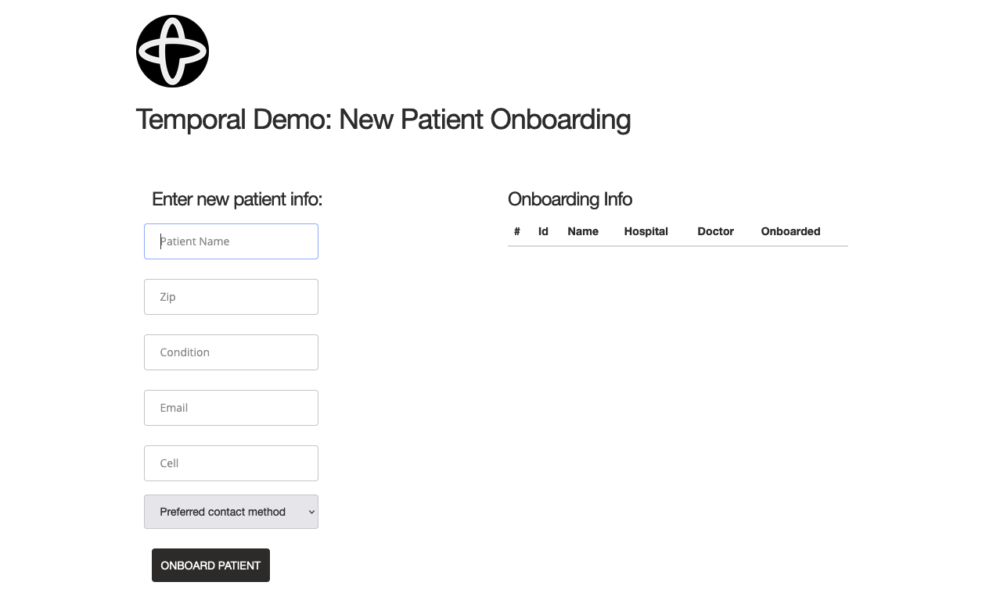
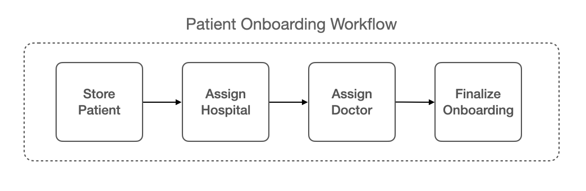
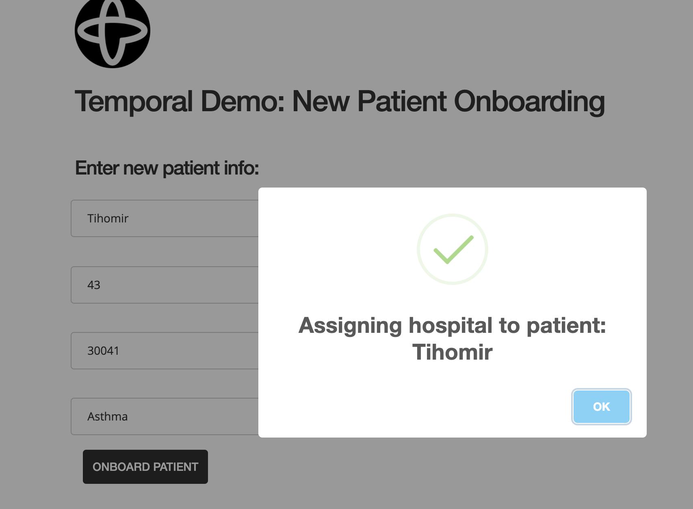
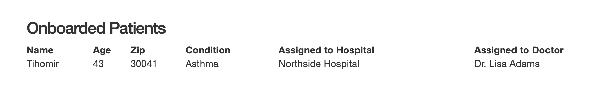
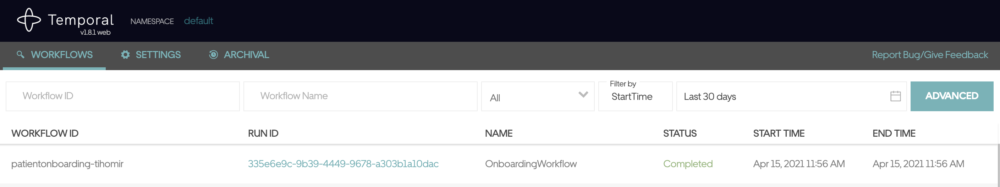

# Temporal Demo: new patient onboarding

Shows Temporal workflow execution running on [Quarkus](https://quarkus.io/).
Uses the [Temporal Java SDK](https://github.com/temporalio/sdk-java).

## Note

This code is for demo purposes only. It is *NOT* meant to be used in production.

## About

In this demo we show off a patient onboarding workflow.
It's main purpose is to:
* Show how to get up and running with Temporal
* Show how to easily add retry logic to your workflows using Temporal
* Show how to easily add compensation logic to your workflows using Temporal
* Show how you can add resiliency to your applications using Temporal

The demo is composed of three modules:
1. The `onboarding-app` module is our app that runs the workflow and its activities. It also includes our onboarding UI.
2. The `onboarding-services` module contains our services which the workflow activities are accessing. It is used to show
workflow retries and compensation in cases of failures.
3. The `onboarding-model` contains our domain model

## Running the demo

1. Start the Temporal Service (docker compose):

```shell script
 git clone https://github.com/temporalio/docker-compose.git
 cd  docker-compose
 docker-compose up
```

2. Clone the repository locally:

```shell script
git clone https://github.com/tsurdilo/temporal-patient-onboarding.git
cd temporal-patient-onboarding
```

3. Start the demo apps:

Start `onboarding-services`:

```shell script
cd onboarding-services
mvn clean install quarkus:dev
```

Start `onboarding-app`:

```shell script
cd onboarding-app
mvn clean install quarkus:dev
```

4. Access the demo services Swagger UI via: [http://localhost:8090/q/swagger-ui/](http://localhost:8090/q/swagger-ui/)

5. Acess the demo app Swagger UI via: [http://localhost:8080/q/swagger-ui/](http://localhost:8080/q/swagger-ui/)

6. Access the demo UI in browser via: [http://localhost:8080](http://localhost:8080)

7. Access the Temporal Web-Ui via: [http://localhost:8088](http://localhost:8088)

## Interacting with the demo

## 1. Running without failures

Our demo has a simple UI that intially looks like this:

<p align="center">

</p>

You can type in the new patient information and here are some useful hints:

Our demo workflow activities will associate the zip code you type in with one of the 
pre-defined hospitals. To get a specific hospital you can use the following zips:
`30041`, `55902`, `90095`, `90048`, `10065`. You can type in any zip you wish but if it's not one 
of those our workflow activities will associate it with the "default" hospital.

There is a number of conditions which you can use to associate the patient with 
one of the pre-defined doctors in the demo. These are:
`Diabetes`, `Anxiety`, `Cancer`, `Asthma`. you can type in any condition you wish but if it's not one of theose
the workflow activities will associate it with the "default" doctor.

Once you fill in the new patient form click the "Onboard Patient" button.

This will start our workflow run which is associated with the new patient that we are onboarding.

Here is how we can visualize our workflow:

<p align="center">

</p>

It is basically a pipeline which executes each of our onboarding activities one after
the other. 

When each activity executes, you will see a notification popup of the activity, for example:

<p align="center">

</p>

These notifications are pushed from our workflow activities.
There is no need to click on the notifications "OK" button. These notifications
will automatically close when the assiciated workflow activitiy has completed
and will dissapear when the workflow run completes.

After the workflow run completes, the section of bottom of the scren will update to show you
that the patient is indeed onboarded:

<p align="center">

</p>

Now let's take a look at our Temporal Web-UI client, it will show us that our workflow execution 
has successfully completed:

<p align="center">

</p>

You can click on the Run Id link and explore the workflow execution history.

## 2. Simulating Services failure - Retries

For this scenario shut down `onboarding-services` so it is not running.
Start onboarding another patient through the UI and submit the form.

Look at the logs of `onboarding-app`, you will see that Temporal is retrying the first activity which is failing
because of an exception.

After about 5 seconds bring up `onboarding-services` again and watch the UI. 
You will see that workflow retries were successfull and you will start seeing the onboarding 
popup messages and that the patient was successfully onboarded.

## 3. Simulating Services failure - Compensation

For this scenario shut down `onboarding-services` so it is not running. 
Start onboarding another patient through the UI and submit the form.

This time do not bring `onboarding-services` and wait until our retries finish (we set the max retries to 6 in our workflow).
Watch the UI, as after all the retries have been performed you will see a notification popul telling you
that the patient was not onboarded. 

Now look at the logs of `onboarding-app`, you will see that right after the defined retries, our workflow has 
performed its compensation (in this demo it is just printing out a message, but irl it could be doing much much more).

You will see a "no" in the onboarded patients "Onboarded" table column.

## 4. Simulating Temporal Server Failure - Recovery

For this scenario make sure our app and services are running.
Start onboarding another patient through the UI and submit the form.
Shortly after, before the workflow completes, shut down the Temporal service.

You will see that the popup messages on the UI will stop maybe after the first or second
popup, depending where during the workflow execution you shut down the service.

Now start the Temporal service back up. When it comes back up watch the application UI
and the Temporal Web UI. You will see that Temporal has recovered our workflow, has replayed it 
to the point of failure (where we shut down the Temporal service) and is contuing its 
execution at that point. 

In the Temporal UI you should see that our onboarding workflow is back to the "Running" status
and that in our application UI the popup messages resume for the remaining activity executions
and that our patient onboarding finishes.

Hope you have fun running this demo! :) 